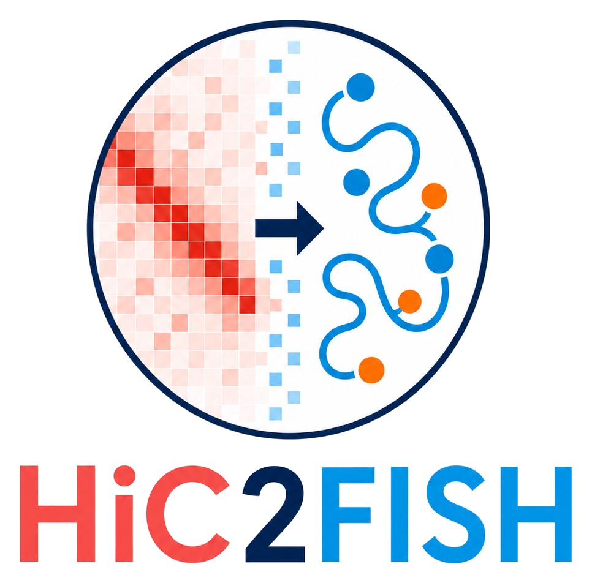
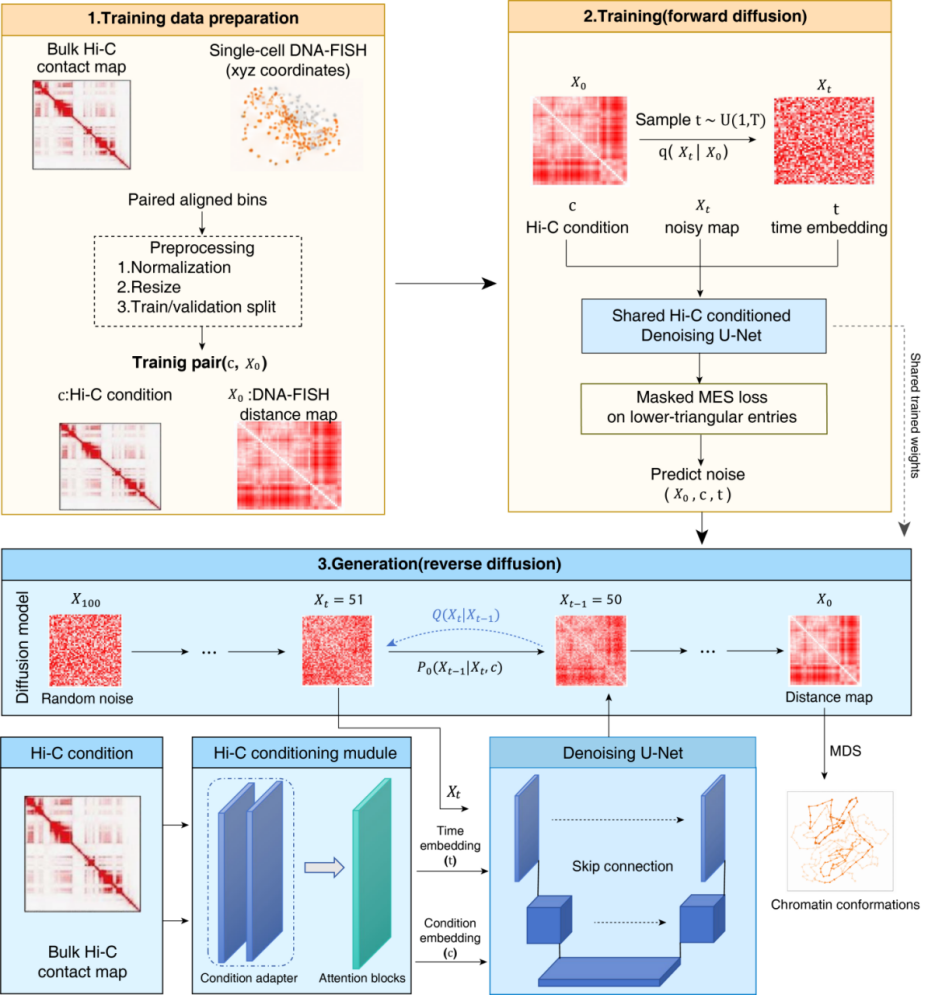
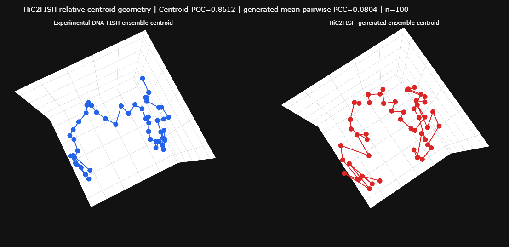

<div align="center">
  

  <p>
    <strong>A conditional diffusion framework for generating single-cell DNA-FISH distance matrices from bulk Hi-C contact maps</strong>
  </p>
</div>

<p align="center">
  
</p>

## Description

HiC2FISH learns the conditional distribution of single-cell DNA-FISH distance matrices given a population Hi-C contact map. A Hi-C contact matrix and a noisy DNA-FISH distance matrix are supplied to a Hi-C-conditioned denoising U-Net. Starting from independently sampled Gaussian noise, deterministic DDIM sampling generates an ensemble of symmetric 50 × 50 distance matrices representing alternative single-cell chromatin conformations under the same Hi-C condition.

This repository contains the model architecture, diffusion sampler, preprocessing workflow, evaluation functions, interactive three-dimensional visualization, example inputs, processed matrices and pretrained model weights.

## Repository structure

```text
HiC2FISH/
├── data/
│   ├── example_data/              # Input files used by the example workflow
│   ├── processed/                 # Preprocessed training and validation arrays
│   └── preprocessing_manifest.csv # Raw-data preprocessing configuration
├── expected_output/               # Reference summary for output verification
├── hic2fish/                       # Reusable Python package
├── output/                         # Files generated by run.py
├── pretrained/                     # Pretrained HiC2FISH checkpoint
├── preprocess_hic2fish_data.py     # Preprocessing entry point
├── run.py                          # Generation and evaluation entry point
├── requirements.txt
└── CODE_STRUCTURE.md
```

Detailed descriptions are provided in the README file within each directory.

## Requirements

The workflow requires Python and the packages listed in `requirements.txt`. A CUDA-enabled PyTorch installation is recommended for faster generation, but CPU execution is also supported.

Core dependencies include:

- PyTorch
- NumPy and SciPy
- pandas and openpyxl
- cooler
- scikit-learn
- Plotly

## Installation

Clone the repository and install the required packages:

```bash
git clone <repository-url>
cd HiC2FISH
pip install -r requirements.txt
```

The pretrained checkpoint and example input files should remain in their default directories:

```text
pretrained/hic2fish.pt
data/example_data/example_hic.npy
data/example_data/example_dna_fish_centroid_um.npy
data/example_data/normalization_scalers.npz
```

## Tutorial: generating a single-cell ensemble

### 1. Run the supplied example

From the repository root, run:

```bash
python run.py
```

The default configuration:

- loads one 50 × 50 bulk Hi-C condition;
- generates 100 single-cell DNA-FISH distance matrices;
- uses 100 deterministic DDIM steps with `eta = 0`;
- uses random seeds 2026–2125;
- calculates Centroid-PCC and generated mean pairwise PCC;
- validates matrix finiteness, non-negativity, symmetry and zero diagonals;
- reconstructs the experimental and generated ensemble centroids by metric MDS;
- writes an interactive three-dimensional HTML comparison.

### 2. Specify generation settings

The principal options can be supplied from the command line:

```bash
python run.py \
  --num-samples 100 \
  --ddim-steps 100 \
  --generation-batch-size 2 \
  --base-seed 2026 \
  --device auto
```

On Windows Command Prompt, use `^` instead of `\` for line continuation:

```bat
python run.py ^
  --num-samples 100 ^
  --ddim-steps 100 ^
  --generation-batch-size 2 ^
  --base-seed 2026 ^
  --device auto
```

Use `--show` to open the interactive visualization automatically after generation:

```bash
python run.py --show
```

Run `python run.py --help` to view all available arguments, including custom input, checkpoint and output paths.

### 3. Inspect the results

Generated files are written to `output/`. The principal outputs are:

- `generated_single_cell_distances_um.npy`: generated single-cell distance matrices in micrometres;
- `generated_ensemble_centroid_um.npy`: mean generated distance matrix;
- `summary.json`: settings, evaluation metrics and numerical-validity checks;
- `centroid_3d_comparison.html`: interactive comparison of relative centroid geometry.

For the supplied example, 100 generated matrices produced a Centroid-PCC of approximately 0.8612 and a generated mean pairwise PCC of approximately 0.0804. Small numerical differences can occur between software versions and hardware platforms.

<p align="center">
  
</p>

The blue structure represents the experimental DNA-FISH ensemble centroid and the red structure represents the HiC2FISH-generated ensemble centroid. 

## Tutorial: preparing Hi-C and DNA-FISH data

Raw DNA-FISH coordinates are supplied as Excel workbooks containing a trace identifier, three-dimensional coordinates and genomic probe intervals. Hi-C contacts are read from a multi-resolution Cooler (`.mcool`) file.

Copy `data/preprocessing_manifest.csv`, add one row for each cell type and genomic window, and provide the corresponding input paths and genomic region. The manifest fields are:

```text
condition_id, fish_xlsx, fish_sheet, mcool_path, chromosome,
region_start, region_end, resolution, balance,
coordinate_scale_to_um, split
```

Run preprocessing with:

```bash
python preprocess_hic2fish_data.py \
  --manifest data/preprocessing_manifest.csv
```

The preprocessing workflow:

1. orders DNA-FISH probes by genomic interval within each `Trace_ID`;
2. restores missing probes at their genomic positions and interpolates missing coordinates;
3. calculates a 50 × 50 Euclidean distance matrix for every retained trace;
4. extracts the requested Hi-C region and resolution from the `.mcool` file;
5. aligns Hi-C contacts to the 50 DNA-FISH probe midpoints;
6. constructs matched Hi-C–DNA-FISH matrix pairs;
7. creates training and validation partitions;
8. calculates separate global min–max scalers from the training partition only.

The resulting arrays are written to `data/processed/`. Existing files are preserved unless `--overwrite` is supplied.

## Evaluation

The included workflow reports two complementary ensemble-level measurements:

- **Centroid-PCC** measures the Pearson correlation between the strict lower triangles of the generated and experimental ensemble-centroid distance matrices.
- **Generated mean pairwise PCC** measures the average correlation among independently generated single-cell matrices under the same Hi-C condition. Lower values indicate less-correlated generated samples and should be interpreted together with DNA-FISH agreement.

The experimental DNA-FISH centroid is used only as an evaluation and visualization reference. It is not supplied to the denoising network and is not used to select individual generated cells.

## Reproducibility notes

- Hi-C and DNA-FISH matrices are normalized separately using global scalers estimated from the training partition.
- Generation uses deterministic DDIM sampling with `eta = 0`; independent cells are obtained from independently seeded initial Gaussian noise matrices.
- Only the strict lower triangle of each final generated matrix is retained and mirrored to obtain a symmetric matrix; diagonal entries are set to zero.
- The interactive MDS output displays relative shape after scale normalization. Absolute distance analyses should use the generated matrices stored in micrometres.

## Citation


## Contact


