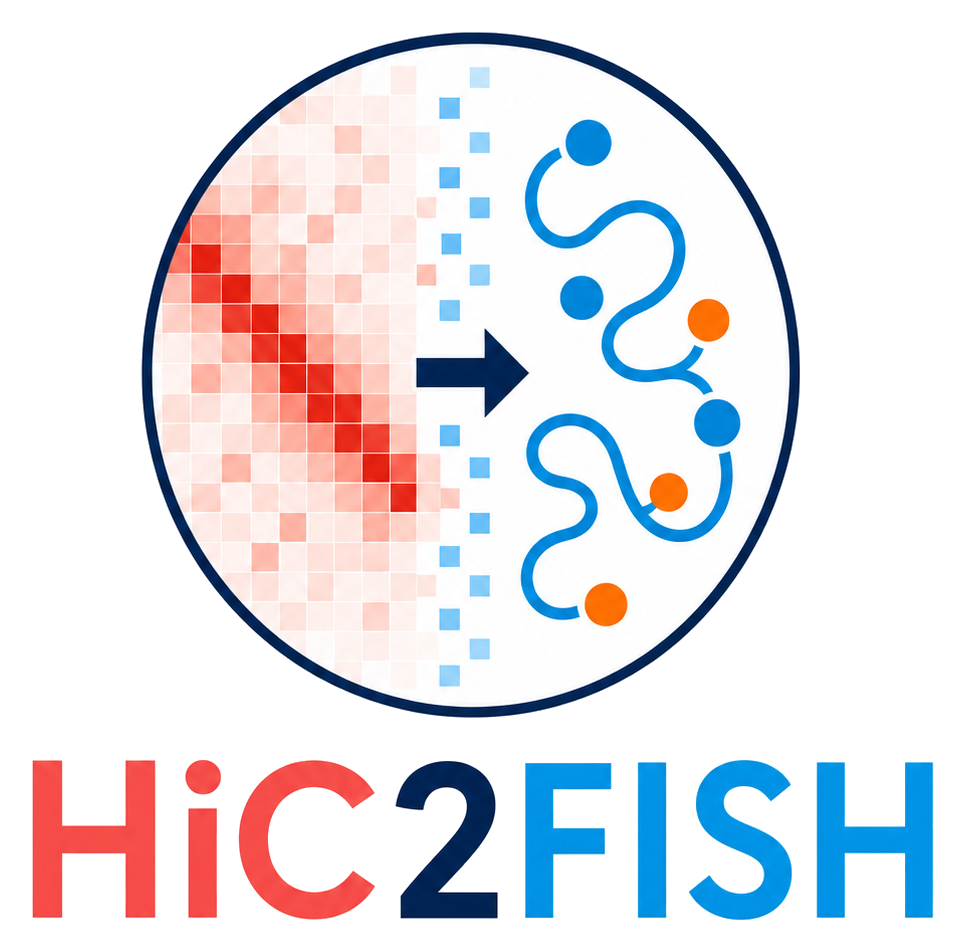
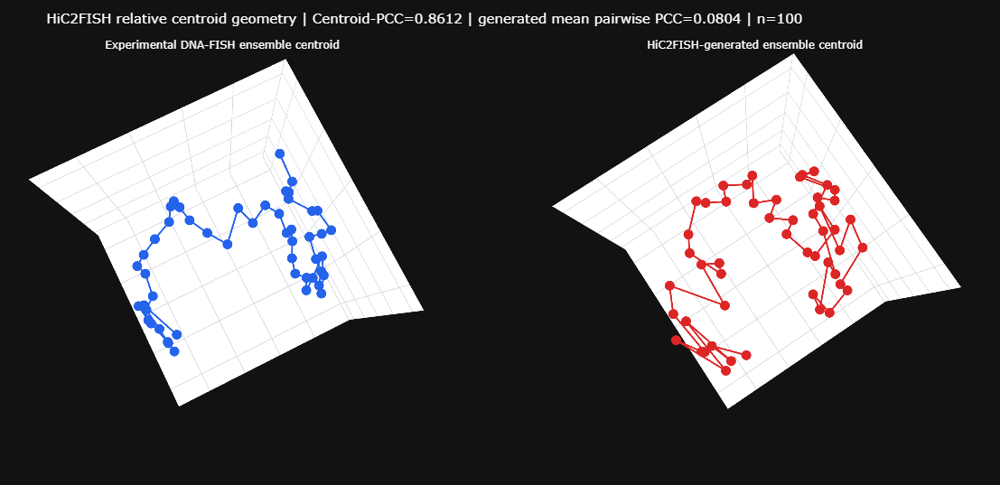

<div align="center">
  

  <p>
    <strong>A conditional diffusion framework for generating single-cell DNA-FISH distance matrices from bulk Hi-C contact maps</strong>
  </p>
</div>

## Contents

* [Description](#description)
* [Repository structure](#repository-structure)
* [Requirements](#requirements)
* [Installation](#installation)
* [Tutorial: generating a single-cell ensemble](#tutorial-generating-a-single-cell-ensemble)
  * [Generate from Hi-C only](#1-generate-from-hi-c-only)
  * [Evaluate against optional DNA-FISH](#2-evaluate-against-optional-dna-fish)
  * [Specify generation settings](#3-specify-generation-settings)
  * [Inspect the results](#4-inspect-the-results)
  * [Lightweight CPU installation check](#5-lightweight-cpu-installation-check)
* [NumPy input shapes](#numpy-input-shapes)
* [Tutorial: preparing paired training data](#tutorial-preparing-paired-training-data)
* [Evaluation](#evaluation)
* [Reproducibility notes](#reproducibility-notes)

## Description

HiC2FISH learns the conditional distribution of single-cell DNA-FISH-calibrated distance matrices given a population Hi-C contact map. During inference, a preprocessed Hi-C contact matrix conditions the denoising of independently sampled Gaussian noise; experimental DNA-FISH from the new condition is not an input to the network. Deterministic DDIM sampling generates an ensemble of symmetric 50 × 50 distance matrices representing alternative single-cell chromatin conformations under the same Hi-C condition. An experimental DNA-FISH centroid can be supplied optionally for evaluation and comparative visualization.

This repository contains the model architecture, diffusion sampler, preprocessing workflow, evaluation functions, interactive three-dimensional visualization, example inputs, processed matrices and pretrained model weights.

## Repository structure

```text
HiC2FISH/
├── data/
│   ├── example_data/              # Input files used by the example workflow
│   ├── processed/                 # Preprocessed training and validation arrays
│   └── preprocessing_manifest.csv # Raw-data preprocessing configuration
├── expected_output/               # Reference summary for output verification
├── hic2fish/                       # Reusable Python package
├── output/                         # Files generated by run.py
├── pretrained/                     # Pretrained HiC2FISH checkpoint
├── preprocess_hic2fish_data.py     # Preprocessing entry point
├── run.py                          # Generation and evaluation entry point
├── requirements.txt
└── CODE_STRUCTURE.md
```

Detailed descriptions are provided in the README file within each directory.

## Requirements

The workflow requires Python and the packages listed in `requirements.txt`. A CUDA-enabled PyTorch installation is recommended for faster generation, but CPU execution is also supported.

Core dependencies include:

- PyTorch
- NumPy and SciPy
- pandas and openpyxl
- cooler
- scikit-learn
- Plotly

## Installation

Install [Git LFS](https://git-lfs.com/) before cloning so the pretrained checkpoint and NumPy data are downloaded as real files rather than pointer text. For Windows PowerShell, activate the environment with `.venv\Scripts\Activate.ps1` before installing requirements. 

Clone the repository and install the required packages:

```bash
git lfs install
git clone https://github.com/tangkailing/HIC2FISH.git
cd HIC2FISH
git lfs pull
python -m venv .venv
source .venv/bin/activate
python -m pip install --upgrade pip
python -m pip install -r requirements.txt
```

The pretrained checkpoint and example input files should remain in their default directories:

```text
pretrained/hic2fish.pt
data/example_data/example_hic.npy
data/example_data/normalization_scalers.npz
data/example_data/example_dna_fish_centroid_um.npy  # optional evaluation reference
```

## Tutorial: generating a single-cell ensemble

Generation and reference-based evaluation are separate operations. Inference requires a preprocessed Hi-C matrix, the pretrained checkpoint and the training-derived normalization scalers. DNA-FISH from the new condition is optional and is used only for evaluation.

### 1. Generate from Hi-C only

From the repository root, run:

```bash
python run.py
```

The default configuration:

- loads one 50 × 50 bulk Hi-C condition;
- generates 100 single-cell DNA-FISH-calibrated distance matrices;
- uses 100 deterministic DDIM steps with `eta = 0`;
- uses random seeds 2026–2125;
- calculates generated mean pairwise PCC;
- validates matrix finiteness, non-negativity, symmetry and zero diagonals;
- writes the generated matrices and their ensemble centroid.

No experimental DNA-FISH is required for this generation path. Without a reference centroid, Centroid-PCC and the experimental-versus-generated comparative HTML are skipped.

To use a custom preprocessed Hi-C matrix:

```bash
python run.py --hic-path path/to/hic_50x50.npy
```

The released inference entry point accepts NumPy matrices, not a raw `.mcool` file. A raw Hi-C file must first be reduced to the selected genomic region and represented as a 50 × 50 matrix consistent with the model input.

### 2. Evaluate against optional DNA-FISH

When an experimental DNA-FISH ensemble centroid is available for the same cell type, provide it explicitly, example_dna_fish_centroid_um.npy is computed from DNA-FISH data.

```bash
python run.py \
  --reference-fish-centroid-path data/example_data/example_dna_fish_centroid_um.npy
```

On Windows Command Prompt:

```bat
python run.py ^
  --reference-fish-centroid-path data\example_data\example_dna_fish_centroid_um.npy
```

This additionally:

- calculates Centroid-PCC between the generated and experimental ensemble centroids;
- reconstructs both centroids by metric MDS;
- writes an interactive three-dimensional comparison.

For the supplied K562 example at `chr21:28,000,000–30,000,000`, 100 generated matrices produced a Centroid-PCC of approximately 0.8612 and a generated mean pairwise PCC of approximately 0.0804. Small numerical differences can occur between software versions and hardware platforms.

<p align="center">
  
</p>

The blue structure represents the experimental DNA-FISH ensemble centroid and the red structure represents the HiC2FISH-generated ensemble centroid. Metric MDS embeds each 50-locus centroid distance matrix into three dimensions so relative locus geometry can be inspected interactively; the coordinates are median-distance and radius normalized for shape comparison, not for absolute distance quantification.

### 3. Specify generation settings

The principal options can be supplied from the command line:

```bash
python run.py \
  --hic-path path/to/hic_50x50.npy \
  --num-samples 100 \
  --ddim-steps 100 \
  --generation-batch-size 2 \
  --base-seed 2026 \
  --device auto
```

On Windows Command Prompt, use `^` instead of `\` for line continuation:

```bat
python run.py ^
  --hic-path path\to\hic_50x50.npy ^
  --num-samples 100 ^
  --ddim-steps 100 ^
  --generation-batch-size 2 ^
  --base-seed 2026 ^
  --device auto
```

Use `--show` together with `--reference-fish-centroid-path` to open the comparative visualization automatically after evaluation. Run `python run.py --help` to view all available arguments.

The supplied pretrained checkpoint was trained for 50 × 50 matrices only, so the selected Hi-C matrix must resolve to exactly 50 × 50. A reference DNA-FISH centroid, when provided, must describe the same loci in the same order and must also be 50 × 50.

### 4. Inspect the results

The following files are always written to the selected output directory:

- `input_hic.npy`: the selected Hi-C condition;
- `generated_single_cell_distances_um.npy`: generated single-cell distance matrices in micrometres;
- `generated_ensemble_centroid_um.npy`: mean generated distance matrix;
- `summary.json`: settings, generated-ensemble diversity, evaluation status and numerical-validity checks.

When `--reference-fish-centroid-path` is supplied, the workflow also writes:

- `reference_dna_fish_centroid_um.npy`: the selected experimental reference centroid;
- `centroid_3d_comparison.html`: interactive comparison of relative centroid geometry;
- the relative-distance and MDS-coordinate arrays used by the visualization.

### 5. Lightweight CPU installation check

After Git LFS files have been downloaded, run a deliberately reduced two-sample, one-step Hi-C-only inference to verify model loading, shape handling, CPU execution and output writing:

```bash
python run.py --device cpu --num-samples 2 --ddim-steps 1 --generation-batch-size 1 --output-dir output/cpu_smoke_test
```

This is an actual reduced inference run rather than the default 100-sample workflow. Its files are written to `output/cpu_smoke_test/` so the supplied reference output is not overwritten.

## NumPy input shapes

`run.py` accepts common `.npy` layouts and selects a single matrix with `--hic-index`:

- `(50, 50)`: one matrix; only `--hic-index 0` is valid.
- `(50, 50, 1)`: one channels-last matrix; only `--hic-index 0` is valid.
- `(n, 50, 50)`: a stack of matrices; `--hic-index` selects the stack element.
- `(n, 50, 50, 1)`: a channels-last stack.
- `(n, 1, 50, 50)`: a channels-first stack.

All selected matrices must contain finite numeric values and must become exactly 50×50 before normalization because the released pretrained model accepts only 50×50 inputs.


## Tutorial: preparing paired training data

This section reconstructs paired Hi-C–DNA-FISH training and validation arrays. It is not required to run inference with the released pretrained checkpoint. Raw DNA-FISH coordinates are supplied as Excel workbooks containing a trace identifier, three-dimensional coordinates and genomic probe intervals. Hi-C contacts are read from a multi-resolution Cooler (`.mcool`) file.

Copy `data/preprocessing_manifest.csv`, add one row for each cell type and genomic window, and provide the corresponding input paths and genomic region. The manifest template has the exact columns consumed by `hic2fish/preprocessing.py`:

| Field | Description |
| --- | --- |
| `condition_id` | Unique label for one biological condition/genomic window; duplicate IDs are rejected. |
| `fish_xlsx` | Path to the raw DNA-FISH Excel workbook, relative to the manifest file or absolute. |
| `fish_sheet` | Optional sheet name or zero-based sheet index; leave blank to use pandas/openpyxl defaults. |
| `mcool_path` | Path to the multi-resolution Cooler (`.mcool`) file, relative to the manifest file or absolute. |
| `chromosome` | Chromosome to extract, such as `chr21` or `21`; both styles are reconciled against the Cooler file. |
| `region_start` | Zero-based genomic start coordinate in base pairs. |
| `region_end` | Genomic end coordinate in base pairs; probe midpoints must be less than this value. |
| `resolution` | Cooler resolution in base pairs, used in the URI `::resolutions/{resolution}`. |
| `balance` | `true`/`false` flag controlling whether balanced Cooler contacts are fetched. |
| `coordinate_scale_to_um` | Multiplicative factor converting workbook coordinates to micrometres; use `1` for micrometres and `0.001` for nanometres. |
| `split` | `train`, `val` or `auto`; blank values are treated as `auto` and assigned with `--val-fraction`. |

Run preprocessing with:

```bash
python preprocess_hic2fish_data.py \
  --manifest data/preprocessing_manifest.csv
```

Example processed arrays in this repository were derived from paired K562 datasets from the 4D Nucleome Data Portal: bulk in situ Hi-C file 4DNFI18UHVRO and multiplexed DNA-FISH experiment set 4DNEST5FUQKC for `chr21:28,000,000-30,000,000`. Raw workbooks and `.mcool` files are not required to run the supplied generation workflow, but they are required if you regenerate `data/processed/`.

The preprocessing workflow:

1. orders DNA-FISH probes by genomic interval within each `Trace_ID`;
2. restores missing probes at their genomic positions and interpolates missing coordinates;
3. calculates a 50 × 50 Euclidean distance matrix for every retained trace;
4. extracts the requested Hi-C region and resolution from the `.mcool` file;
5. aligns Hi-C contacts to the 50 DNA-FISH probe midpoints;
6. constructs matched Hi-C–DNA-FISH matrix pairs;
7. creates training and validation partitions;
8. calculates separate global min–max scalers from the training partition only.

The resulting arrays are written to `data/processed/`. Existing files are preserved unless `--overwrite` is supplied.

## Evaluation

When an optional reference DNA-FISH centroid is supplied, the workflow reports Centroid-PCC in addition to the generated-ensemble diversity measurement:

- **Centroid-PCC** measures the Pearson correlation between the strict lower triangles of the generated and experimental ensemble-centroid distance matrices.
- **Generated mean pairwise PCC** measures the average lower-triangle correlation among independently generated single-cell matrices under the same Hi-C condition. Values near 1 indicate very similar generated cells, while lower values indicate greater ensemble diversity; interpret this diversity together with Centroid-PCC rather than as a standalone accuracy score.

The experimental DNA-FISH centroid is used only as an evaluation and visualization reference. It is not supplied to the denoising network and is not used to select individual generated cells.

## Reproducibility notes

- Hi-C and DNA-FISH matrices are normalized separately using global scalers estimated from the training partition.
- Generation uses deterministic DDIM sampling with `eta = 0`; independent cells are obtained from independently seeded initial Gaussian noise matrices.
- Only the strict lower triangle of each final generated matrix is retained and mirrored to obtain a symmetric matrix; diagonal entries are set to zero.
- The interactive MDS output displays relative shape after scale normalization. Absolute distance analyses should use the generated matrices stored in micrometres.

## Citation

A manuscript describing HiC2FISH is currently under review.
Citation information will be updated upon publication.

## Contact

Please open a GitHub issue for software questions.
For research-related inquiries, contact li.tang@yale.edu

